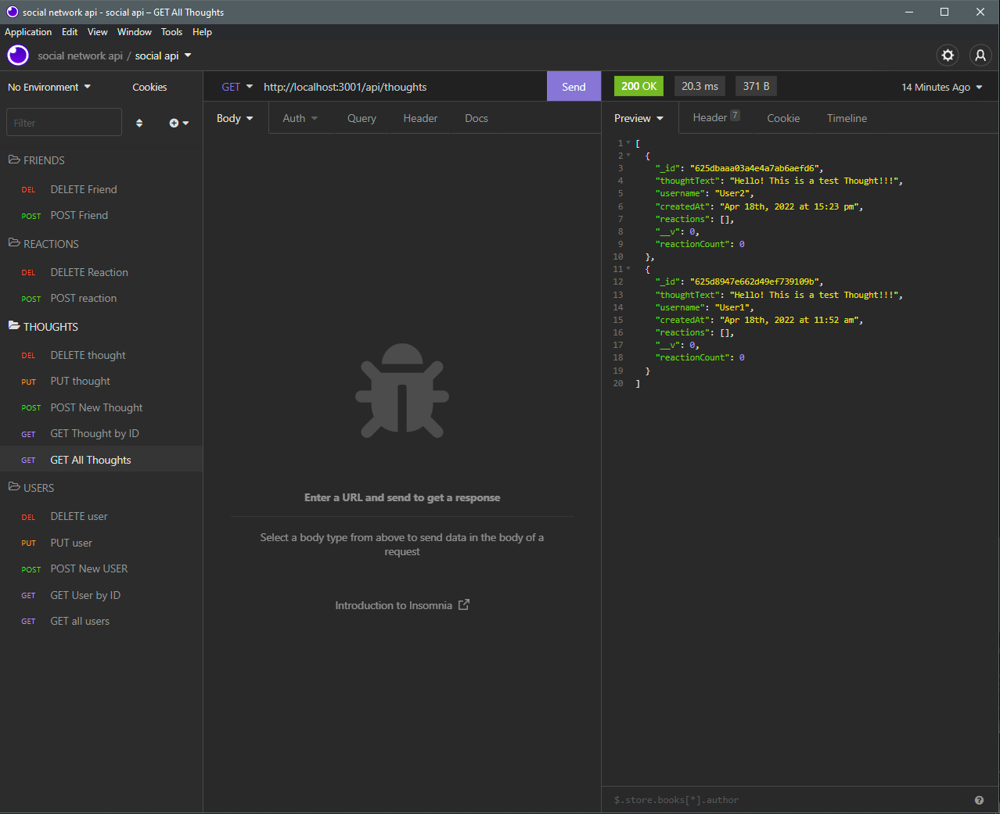
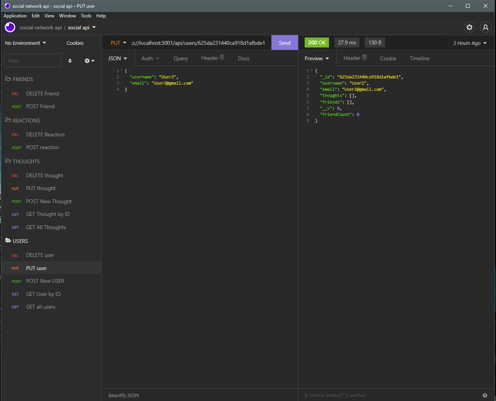
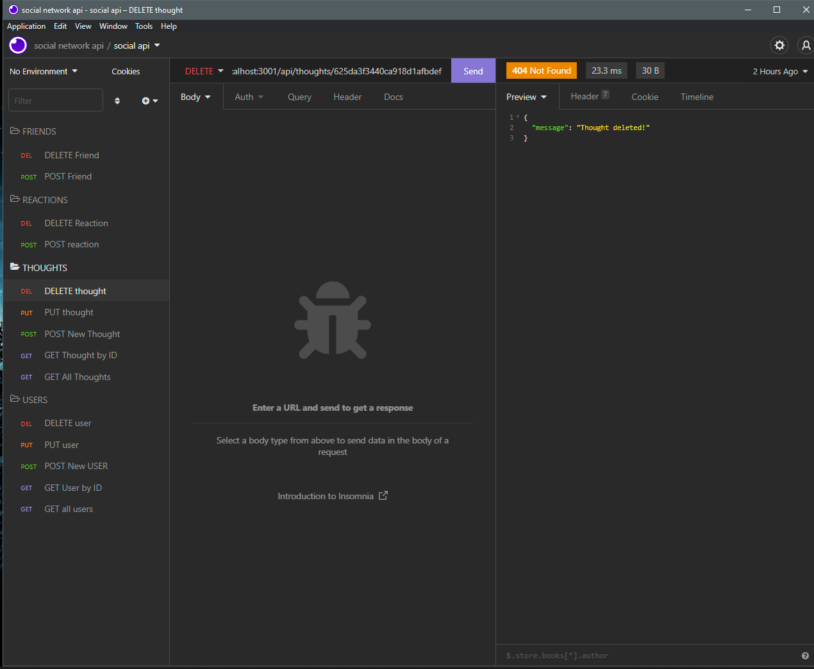
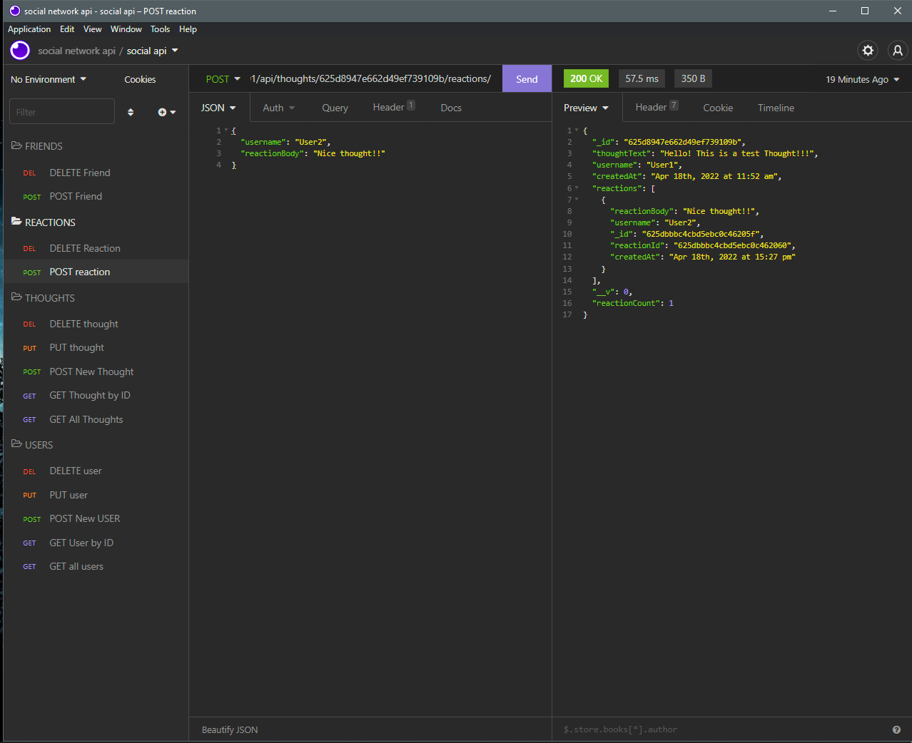
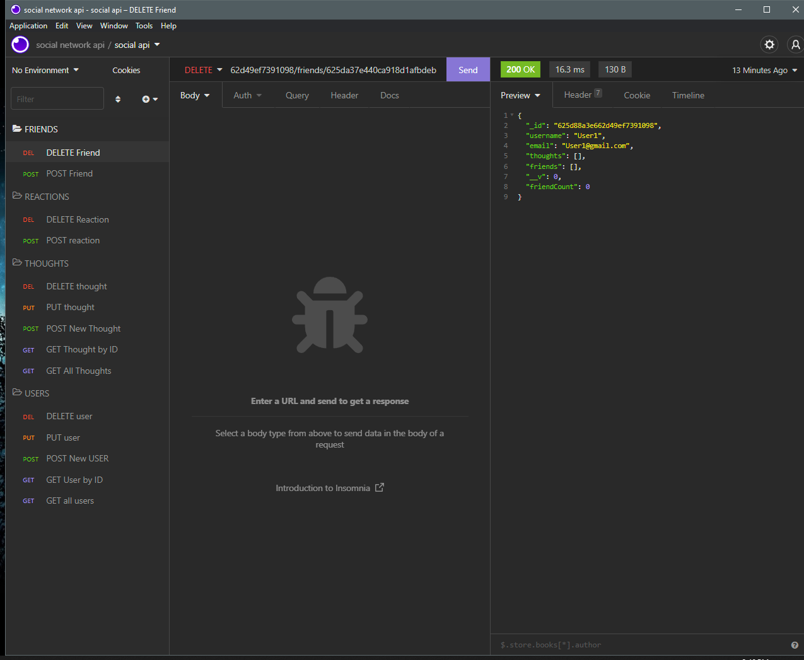

# social-network-api
 
 

---
 
 
 

 
 
 

---
 
 

# User Story

- AS A social media startup
I WANT an API for my social network that uses a NoSQL database
SO THAT my website can handle large amounts of unstructured data

# Acceptance Criteria

- GIVEN a social network API
WHEN I enter the command to invoke the application
THEN my server is started and the Mongoose models are synced to the MongoDB database
WHEN I open API GET routes in Insomnia for users and thoughts
THEN the data for each of these routes is displayed in a formatted JSON
WHEN I test API POST, PUT, and DELETE routes in Insomnia
THEN I am able to successfully create, update, and delete users and thoughts in my database
WHEN I test API POST and DELETE routes in Insomnia
THEN I am able to successfully create and delete reactions to thoughts and add and remove friends to a user’s friend list

# Description
- A social network backend created for users to share/post their thoughts. The api allows users to add each other as friends and react to the thoughts of their friends as well as other users. The api uses mongoose and mongodb for the backend frameworks, and an express server.  

# Installation and Usage
- Download repo to local machine
- Open terminal in root of repository and run "npm i"
- Once dependencies are installed run "node server"
- Test Routes in insomnia 

- USER routes
- 1. /api/users - GET all users
- 2. /api/users/:userId - GET/PUT/DELETE user by ID
- 3. /api/users/:userId/friends/:friendId - POST/DELETE friends

- THOUGHT routes
- 1. /api/thoughts - GET all thoughts
- 2. /api/thoughts/:thoughtId - GET/PUT/DELETE though by ID
- 3. /api/thoughts/:thoughtId/reactions - POST reactions
- 4. /api/thoughts/:thoughtId/reactions/:reactionId - DELETE reactions

# Demonstration

Video Demo:
- https://youtu.be/VSC_Pb5GNLo

Alternative Demo Links:

- https://drive.google.com/file/d/1Fd0ioTTLupnsxAQBLQXT6Qk7dijtcaz-/view
- https://youfiles.herokuapp.com/videodictionary/?m=Video_Player_Drive&state=%7B%22ids%22:%5B%221Fd0ioTTLupnsxAQBLQXT6Qk7dijtcaz-%22%5D,%22action%22:%22open%22,%22userId%22:%22115747972767466475110%22,%22resourceKeys%22:%7B%7D%7D

# Screenshots

 

 

 

 

 

---

# Links

Github Repository:

 - https://github.com/Vithursan6/social-network-api

Video Demo:

- https://youtu.be/VSC_Pb5GNLo

Alternative links for demo

- https://drive.google.com/file/d/1Fd0ioTTLupnsxAQBLQXT6Qk7dijtcaz-/view
- https://youfiles.herokuapp.com/videodictionary/?m=Video_Player_Drive&state=%7B%22ids%22:%5B%221Fd0ioTTLupnsxAQBLQXT6Qk7dijtcaz-%22%5D,%22action%22:%22open%22,%22userId%22:%22115747972767466475110%22,%22resourceKeys%22:%7B%7D%7D

# License

MIT License

Copyright (c) 2022 Vithursan6

Permission is hereby granted, free of charge, to any person obtaining a copy
of this software and associated documentation files (the "Software"), to deal
in the Software without restriction, including without limitation the rights
to use, copy, modify, merge, publish, distribute, sublicense, and/or sell
copies of the Software, and to permit persons to whom the Software is
furnished to do so, subject to the following conditions:

The above copyright notice and this permission notice shall be included in all
copies or substantial portions of the Software.

THE SOFTWARE IS PROVIDED "AS IS", WITHOUT WARRANTY OF ANY KIND, EXPRESS OR
IMPLIED, INCLUDING BUT NOT LIMITED TO THE WARRANTIES OF MERCHANTABILITY,
FITNESS FOR A PARTICULAR PURPOSE AND NONINFRINGEMENT. IN NO EVENT SHALL THE
AUTHORS OR COPYRIGHT HOLDERS BE LIABLE FOR ANY CLAIM, DAMAGES OR OTHER
LIABILITY, WHETHER IN AN ACTION OF CONTRACT, TORT OR OTHERWISE, ARISING FROM,
OUT OF OR IN CONNECTION WITH THE SOFTWARE OR THE USE OR OTHER DEALINGS IN THE
SOFTWARE.

# Author

Vithursan6
- github https://github.com/Vithursan6